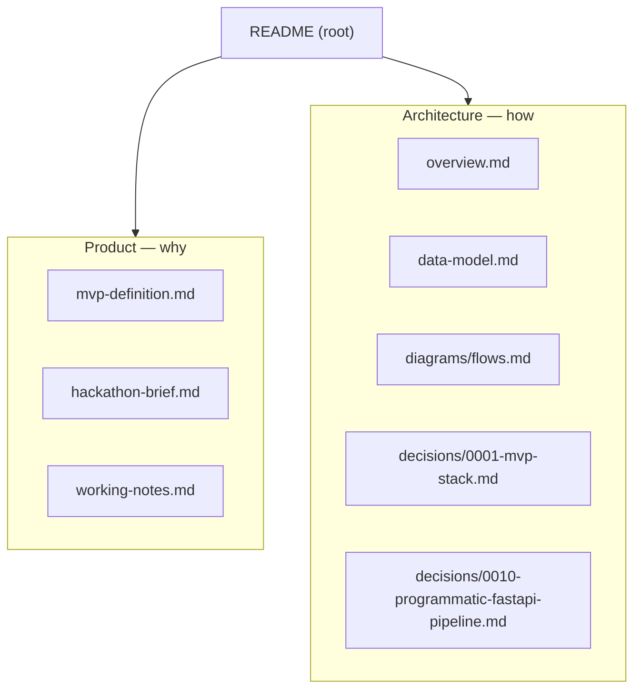

# Halketon Documentation

WhatsApp-first **operational memory** for NGO teams — capture commitments from everyday
WhatsApp messages and meetings, structure them with an LLM, and give leadership a simple
view of load, deadlines, and follow-up risk.

> New here? Read in this order: **Product** → **Architecture** → **Flows**.

## Map

## Contents

### Product (the *why*)
- [`product/mvp-definition.md`](product/mvp-definition.md) — thesis, users, hero use case, features, non-goals, demo script.
- [`product/hackathon-brief.md`](product/hackathon-brief.md) — the official Halketon challenge brief (3 tracks, drawn from 16 NGO interviews).
- [`product/working-notes.md`](product/working-notes.md) — team strategy & brainstorm (track choice, adoption principles, scope).

### Architecture (the *how*)
- [`architecture/overview.md`](architecture/overview.md) — **start here.** Context, container, deployment & implementation-status diagrams; component responsibilities; tech stack; env vars.
- [`architecture/data-model.md`](architecture/data-model.md) — ERD, table reference, enums, conventions.
- [`diagrams/flows.md`](diagrams/flows.md) — runtime sequence diagrams (task capture, meeting extraction, reminders).

### Team / Process (the *how we work*)
- [`team/README.md`](team/README.md) — **hackathon playbook.** Roles, the 3 un-blocking rules, kickoff decisions.
- [`team/roles-and-ownership.md`](team/roles-and-ownership.md) — vertical slices, file-ownership map, shared contracts.
- [`team/git-workflow.md`](team/git-workflow.md) — branches, PRs, merge rules, integration freeze.
- [`team/testing.md`](team/testing.md) — TDD approach, what is/isn't testable here, tooling, worked examples, per-role guide.
- [`team/timeline-and-checkpoints.md`](team/timeline-and-checkpoints.md) — hour-by-hour plan, Definition of Done, smoke checklist, demo runbook, cut list.

### Decisions
- [`decisions/0001-mvp-stack.md`](decisions/0001-mvp-stack.md) — ADR: why Twilio + Supabase + Next.js (orchestration superseded by 0010).
- [`decisions/0002-multi-organization-schema.md`](decisions/0002-multi-organization-schema.md) — ADR: multi-org, roles, settings, invitations.
- [`decisions/0003-teams-and-categories.md`](decisions/0003-teams-and-categories.md) — ADR: teams, categories, dashboard filters.
- [`decisions/0004-projects-and-hierarchy.md`](decisions/0004-projects-and-hierarchy.md) — ADR: projects, role-gated creation.
- [`decisions/0005-llm-project-disambiguation.md`](decisions/0005-llm-project-disambiguation.md) — ADR: LLM project vs standalone + user prompt.
- [`decisions/0006-global-organization-tasks.md`](decisions/0006-global-organization-tasks.md) — ADR: org-wide global tasks.
- [`decisions/0007-whatsapp-org-resolution.md`](decisions/0007-whatsapp-org-resolution.md) — ADR: Twilio number per org + people validation.
- [`decisions/0010-programmatic-fastapi-pipeline.md`](decisions/0010-programmatic-fastapi-pipeline.md) — ADR: programmatic FastAPI pipeline; n8n reduced to a scheduler.

### Reference
- [`reference/`](reference/) — source PDF (base architecture & product definition).

## Related artifacts (outside `docs/`)
- [`../database/schema.sql`](../database/schema.sql) · [`../database/seeds.sql`](../database/seeds.sql) — Postgres schema & demo data.
- [`../prompts/task-extraction.md`](../prompts/task-extraction.md) · [`../prompts/project-assignment-reply.md`](../prompts/project-assignment-reply.md) · [`../prompts/whatsapp-org-resolution.md`](../prompts/whatsapp-org-resolution.md) — extraction, project disambiguation, org resolution.
- [`../apps/api/`](../apps/api/) — FastAPI backend (the whole pipeline). *(n8n is now just a scheduled trigger.)*
- [`../apps/dashboard-web/`](../apps/dashboard-web/) — Next.js leadership dashboard.
- [`../src/`](../src/) — ⚠️ TS prototype, reference-only; removed after the FastAPI port.

## Current status at a glance

| Layer | State |
|---|---|
| DB schema + seeds | ✅ Complete |
| Prompt templates | ✅ Complete |
| Dashboard UI (mock data) | ✅ Complete |
| TS prototype (`src/`) | 🟡 Reference (webhook→extract→reply, no DB) |
| FastAPI backend (capture / reminders / meetings) | 🔴 Not started |
| Live Supabase reads / meeting flow | 🔴 Not started |

Full breakdown in [`architecture/overview.md` §8](architecture/overview.md#8-implementation-status-target-vs-today).
