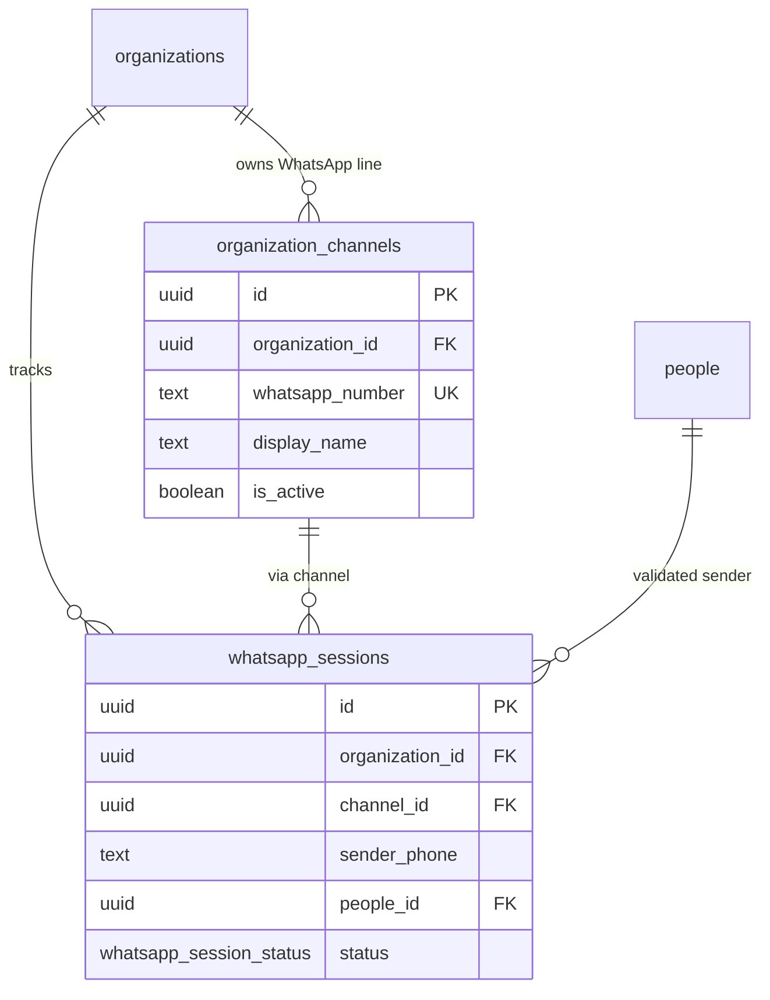
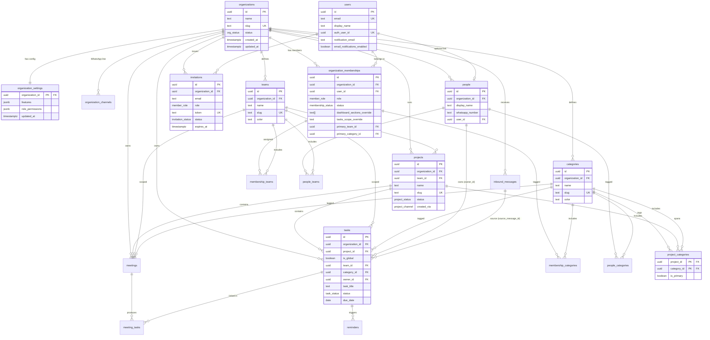
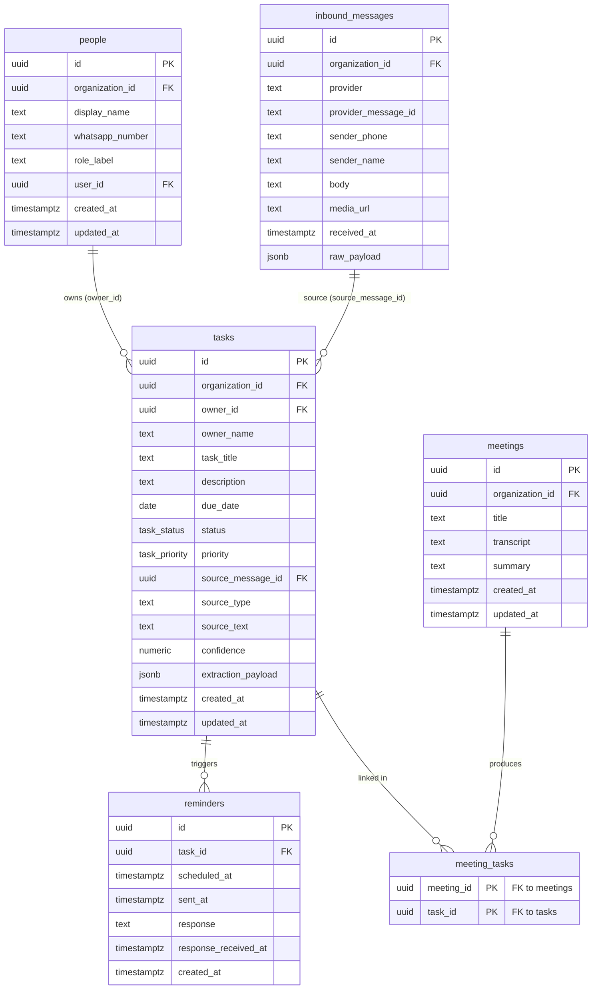
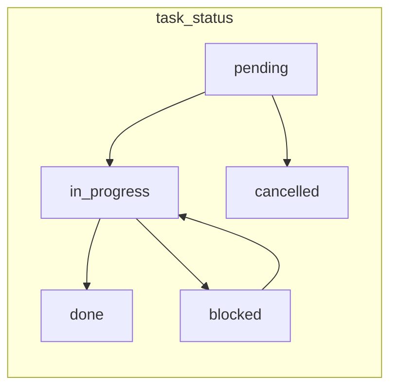

# Data Model

The durable source of truth is PostgreSQL (via Supabase). The full DDL lives in
[`../../database/schema.sql`](../../database/schema.sql); demo rows in
[`../../database/seeds.sql`](../../database/seeds.sql). This page is the human-readable
map of that schema.

---

## Multi-organization model

One deployment serves many NGOs. Every operational row is scoped by `organization_id`.
Dashboard users belong to one or more organizations via `organization_memberships`, each
with a **role** that controls what they see and what data they can access.

### WhatsApp: org resolution (canal + identidad)

Each org has a dedicated Twilio number in **`organization_channels`**. Inbound webhooks
resolve `organization_id` from the **`To`** field, then validate the sender **`From`**
against **`people`** in that org.

| Layer | Source | Resolves |
|---|---|---|
| Canal | `organization_channels.whatsapp_number` = Twilio `To` | Which org |
| Identidad | `people.whatsapp_number` = Twilio `From` + same `organization_id` | Authorized person |

If the same phone exists in multiple orgs, each org line is independent — the user must
message the correct number. **`whatsapp_sessions`** holds welcome / redirect menu state
until the session is `active`. Full flow:
[`../../prompts/whatsapp-org-resolution.md`](../../prompts/whatsapp-org-resolution.md).



---



---

## Teams & categories

Each organization defines its own **teams** (grupos de trabajo: Coordinación, Territorio,
Voluntariado) and **categories** (áreas programáticas: Nutrición, Educación,
Administración). Both are org-scoped lookup tables with unique `(organization_id, slug)`.

### User assignments

| Join table | Links | Purpose |
|---|---|---|
| `membership_teams` | dashboard user ↔ team | Which teams a user belongs to |
| `membership_categories` | dashboard user ↔ category | Which program areas a user covers |
| `people_teams` | WhatsApp contact ↔ team | Auto-tag tasks from WhatsApp by owner |
| `people_categories` | WhatsApp contact ↔ category | Same for program area |
| `invitation_teams` / `invitation_categories` | pending invite ↔ team/category | Pre-assign on registration |

Optional defaults on `organization_memberships`:
- `primary_team_id` — initial team filter when opening the dashboard.
- `primary_category_id` — initial category filter.

### Task & meeting tagging

`tasks` and `meetings` carry optional `team_id` + `category_id` for dashboard filtering.
A trigger (`assert_org_scoped_fk`) rejects FKs that belong to a different organization.

When n8n creates a task from WhatsApp and the owner is a known `people` row, the app
can copy team/category from `people_teams` / `people_categories` (first match or primary).

---

## Dashboard filtering (proyecto, categoría, equipo)

Los selectores del dashboard son **independientes y combinables**. Cada filtro NULL
significa “sin restricción en esa dimensión”. Feature flags:
`team_category_filters`, `project_filters`.

### Proyectos con múltiples categorías

Un proyecto puede pertenecer a **varias categorías** vía `project_categories`.
Una sola puede marcarse `is_primary = true` (default al heredar tags en tareas).

Ejemplo demo: *Taller nutrición comunitaria* → Nutrición (primary) + Educación.

Las **tareas** mantienen un `category_id` propio (la categoría concreta de esa tarea
dentro del proyecto). Así el filtro **proyecto + categoría** distingue tareas del mismo
proyecto bajo distintas categorías programáticas.

### Alcance de tareas: global, proyecto, standalone

`tasks.project_id` es **nullable** y `tasks.is_global` marca compromisos de **toda la organización**.

| Caso | `project_id` | `is_global` | Comportamiento |
|---|---|---|---|
| Tarea en un proyecto | UUID | `false` | Hereda team/categoría primary si faltan tags |
| Tarea standalone | `NULL` | `false` | Ad-hoc; taggeada por equipo/categoría/owner |
| **Tarea global** | `NULL` | **`true`** | Impacto org-wide; visible para todos los roles |
| Proyecto archivado | FK → `ON DELETE SET NULL` | `false` | La tarea sobrevive sin proyecto |

Constraint DDL: `is_global` implica `project_id IS NULL`.

**Tareas globales:** personería jurídica, auditorías, obligaciones estatutarias. Sección
`global_tasks` en dashboard. Creación: solo owner/admin (`can_create_global_tasks`).
Visibilidad: todos (`can_view_global_tasks`), incluso con `tasks_scope = assigned`.

**Standalone vs global:** filtro “Sin proyecto” → `project_id IS NULL AND NOT is_global`.
Filtro “Solo globales” → `global_filter = 'global_only'`.

Sin filtro de proyecto, la vista incluye **proyecto + standalone + global**.

### Modos de filtrado

| Modo | Selectores activos | Resultado |
|---|---|---|
| Sin filtro de proyecto | — | Proyecto + standalone + global |
| Solo proyecto | `project_id` | Tareas de ese proyecto |
| Sin proyecto | `project_filter = 'none'` | Standalone (`NOT is_global`) |
| Solo globales | `global_filter = 'global_only'` | `is_global = true` |
| Solo categoría | `category_id` | Standalone/global/proyectos que coinciden |
| Proyecto + categoría | ambos | Tareas del proyecto en esa categoría |
| Equipo (+ cualquiera arriba) | `team_id` + … | Intersección con dimensión equipo |

### SQL de referencia (app layer)

```sql
WHERE t.organization_id = :org_id

  -- Proyecto: UUID, 'none' = standalone (sin global), omitir globales con exclude_global
  AND (
    :project_filter IS NULL
    OR (:project_filter != 'none' AND t.project_id = :project_filter::uuid)
    OR (:project_filter = 'none' AND t.project_id IS NULL AND NOT t.is_global)
  )

  AND (
    :global_filter IS NULL
    OR :global_filter = 'all'
    OR (:global_filter = 'global_only' AND t.is_global)
    OR (:global_filter = 'exclude_global' AND NOT t.is_global)
  )

  -- Categoría (opcional): lógica distinta si hay proyecto seleccionado
  AND (
    :category_id IS NULL
    OR (
      -- Proyecto + categoría: tareas del proyecto en esa categoría concreta
      :project_filter IS NOT NULL
      AND :project_filter != 'none'
      AND t.project_id = :project_filter::uuid
      AND t.category_id = :category_id
    )
    OR (
      -- Solo categoría (o filtro "sin proyecto" + categoría)
      (:project_filter IS NULL OR :project_filter = 'none')
      AND (
        t.category_id = :category_id
        OR (
          t.project_id IS NOT NULL
          AND EXISTS (
            SELECT 1 FROM project_categories pc
            WHERE pc.project_id = t.project_id
              AND pc.category_id = :category_id
          )
        )
      )
    )
  )

  -- Equipo (opcional)
  AND (:team_id IS NULL OR t.team_id = :team_id)

  -- Scope por rol (global tasks siempre visibles si can_view_global_tasks)
  AND (
    t.is_global = true
    OR :tasks_scope = 'all'
    OR (
      :tasks_scope = 'team'
      AND t.team_id IN (
        SELECT team_id FROM membership_teams WHERE membership_id = :membership_id
      )
    )
    OR (
      :tasks_scope = 'assigned'
      AND t.owner_id IN (
        SELECT id FROM people
        WHERE user_id = :user_id AND organization_id = :org_id
      )
    )
  )
```

**WhatsApp / n8n:** la captura habitual crea tareas **sin** `project_id` salvo que el mensaje
mencione un proyecto existente o el flujo lo asigne explícitamente. No se exige proyecto
al insertar.

### Resolución de proyecto vía LLM (WhatsApp)

Flujo en [`../../prompts/task-extraction.md`](../../prompts/task-extraction.md):

1. n8n carga `active_projects` de la org y los pasa al LLM junto con el mensaje.
2. El LLM devuelve `is_global` y `project_resolution.status`:
   - `is_global: true` → insertar con `is_global = true` (sin proyecto)
   - `matched` → insertar tarea con `project_id`
   - `standalone` → insertar individual
   - `needs_clarification` → draft + lista (`0`, `G`, proyectos…)
3. El usuario responde → [`project-assignment-reply.md`](../../prompts/project-assignment-reply.md)
   → insertar tarea y cerrar draft.

Diagrama: [`../diagrams/flows.md`](../diagrams/flows.md) §1b.

**Nota:** en proyectos multi-categoría, cada tarea con proyecto debe llevar `category_id`
explícito para el filtro **proyecto + categoría**. Tareas standalone se taggean por
equipo/categoría/owner como cualquier otra fila sin herencia de proyecto.

Defaults por rol en `role_permissions`:
- `default_project_filter`: `"all"` | `"assigned_projects"`
- `default_category_filter`: `"all"` | `"user_categories"`
- `default_team_filter`: `"all"` | `"user_teams"`

Resolución al login: features → defaults de rol → overrides de membership → estado UI.

---

## Projects

**Projects** agrupan tareas bajo un objetivo con plazos. Son org-scoped, con `team_id`
opcional y **múltiples categorías** en `project_categories`. Las tareas referencian
`project_id`.

### Tabla `projects` + `project_categories`

| Campo | Descripción |
|---|---|
| `projects.name`, `slug` | Identificación única por org |
| `projects.status` | `planning`, `active`, `on_hold`, `completed`, `archived` |
| `projects.team_id` | Equipo responsable (opcional) |
| `project_categories` | M2M categorías del proyecto; una `is_primary` |
| `created_via` | `dashboard`, `whatsapp`, `meeting` |

Al insertar una tarea con `project_id` y sin tags, `inherit_task_project_tags` copia
`team_id` del proyecto y la categoría `is_primary`. Si `project_id` es NULL, el trigger
no actúa — la tarea queda standalone.

### Creación restringida por jerarquía

La autorización vive en `organization_settings.role_permissions` (no en el DDL).
El dashboard y n8n deben validar **antes** de insertar:

| Rol | `can_create_projects` | Dashboard | WhatsApp bot | `can_manage_projects` |
|---|---|---|---|---|
| `owner` | ✅ | ✅ | ✅ | ✅ (editar/archivar) |
| `admin` | ✅ | ✅ | ✅ | ✅ |
| `manager` | ✅ | ✅ | ✅ | ❌ |
| `member` | ❌ | ❌ | ❌ | ❌ |

Flags por rol:
- `can_create_projects` — puede crear proyectos por algún canal.
- `can_create_projects_via_dashboard` — UI de proyectos.
- `can_create_projects_via_whatsapp` — bot (n8n resuelve `people` → `user_id` → membership → rol).
- `can_manage_projects` — editar, archivar, reasignar (owner/admin).

Override opcional: `organization_memberships.can_create_projects_override` (boolean).

**Flujo WhatsApp (n8n):**
1. Resolver `people` por `sender_phone` + `organization_id`.
2. Si tiene `user_id`, cargar membership y `role_permissions`.
3. Si `can_create_projects_via_whatsapp` es false → responder sin crear; sugerir contactar coordinación.
4. Si true → insertar `projects` con `created_via = whatsapp`, `created_by_people_id = people.id`.

**Flujo dashboard:**
1. Resolver membership del usuario autenticado.
2. Validar `can_create_projects_via_dashboard`.
3. Insertar con `created_via = dashboard`, `created_by_user_id = users.id`.

Feature flag: `organization_settings.features.projects` deshabilita el módulo completo.

---

## Role hierarchy & dashboard visibility

Roles form a hierarchy from broadest to narrowest access:

| Role | Typical user | Dashboard sections | Task scope |
|---|---|---|---|
| `owner` | Fundadora / directora | All (incl. projects, settings, users) | All org tasks |
| `admin` | Coordinación general | All (incl. projects, settings, users) | All org tasks |
| `manager` | Jefe de equipo | Summary, tasks, projects, calendar, team | Tasks in user's teams |
| `member` | Voluntario/a | Tasks, calendar | Assigned + user's team/category filters |

Defaults live in `organization_settings.role_permissions` (JSONB). Admins can
toggle org-wide features in `organization_settings.features` (e.g. disable
`calendar_view` or `reminders` for the whole org).

Per-member overrides are optional on `organization_memberships`:
- `dashboard_sections_override` — replace the role default section list.
- `tasks_scope_override` — `all` | `team` | `assigned`.

The dashboard resolves effective permissions at login:

1. Load org `features` → hide disabled modules globally.
2. Load membership `role` → read defaults from `role_permissions`.
3. Apply membership overrides if present.

---

## User registration via invitation link

`invitations` supports onboarding without manual admin setup:

1. Admin creates an invitation (email + role) → system generates a unique `token`.
2. Share link: `/invite/{token}` (app route, not in DB).
3. Invitee registers (or logs in) → membership created, invitation marked `accepted`.

Constraints:
- One pending invite per `(organization_id, email)`.
- Token expires after 7 days by default (`expires_at`).
- Status lifecycle: `pending` → `accepted` | `expired` | `revoked`.

Demo token in seeds: `demo-invite-token-esperanza`.

---

## Entity-relationship diagram (operational data)



---

## Tables

### `organizations`
Tenant root. `slug` is unique and used in URLs (`/org/fundacion-esperanza/...`).
Auto-creates a default `organization_settings` row on insert (trigger).

### `organization_channels`
Maps one Twilio WhatsApp number (`whatsapp:+E164`) to an organization. Inbound `To`
resolves tenant context before any business logic.

### `whatsapp_sessions`
Per-sender state on an org's WhatsApp line: welcome confirm, org redirect, or `active`
(authorized for task capture). Expires after 7 days by default.

### `organization_settings`
Global config per org, editable from the dashboard:
- **`features`** — boolean flags for modules (`whatsapp_capture`, `meeting_memory`,
  `reminders`, `calendar_view`, `team_load_view`, `assigned_tasks_view`,
  `team_category_filters`, `project_filters`, `standalone_tasks`, `global_tasks`,
  `projects`, `beneficiary_tracking`).
- **`role_permissions`** — default dashboard sections, task scope, filter defaults, and
  project creation flags per role.

### `projects` + `project_categories`
Org-scoped containers for related tasks. Categories are M2M (`project_categories`) so a
project can span multiple program areas. Creation is authorized by role + channel.

### `teams` / `categories`
Org-scoped taxonomies for grouping users and filtering dashboard data. Managed via
settings/users CRUD. `slug` is unique per org for stable URLs and API keys.

### `membership_teams` / `membership_categories`
Many-to-many: which teams and categories each dashboard user belongs to.

### `people_teams` / `people_categories`
Many-to-many: team/category tags on WhatsApp contacts for auto-tagging and scope.

### `users`
Dashboard accounts with email for login and notifications. Separate from `people`
(WhatsApp contacts). Linked optionally via `people.user_id`.

### `organization_memberships`
Join table: which users belong to which org and with what role. Supports per-member
permission overrides and optional `primary_team_id` / `primary_category_id` for default
dashboard filters.

### `invitations`
Shareable registration links. Stores target email, assigned role, token, expiry,
and acceptance audit fields. Teams/categories pre-assigned via `invitation_teams` and
`invitation_categories`.

### `people`
Team members who can own tasks. Scoped per org (`organization_id, whatsapp_number`
is unique). Can link to a `users` row when the person also has dashboard access.

### `inbound_messages`
Raw, append-only log of everything received from the messaging edge (default provider
`twilio`). Scoped by `organization_id`. Keeps `raw_payload` for traceability.

### `tasks`
The core entity, scoped by `organization_id`. Three scope levels:

1. **Global** (`is_global = true`) — org-wide; all roles see them; no `project_id`.
2. **Project** (`project_id` set, `is_global = false`).
3. **Standalone** (both false/null) — ad-hoc individual work.

`project_id` is optional. Notable design choices:
- **Denormalized `owner_name`** alongside the `owner_id` FK, so a task survives even when
  the sender isn't yet a known `people` row.
- `source_type` (`whatsapp` / `meeting` / `manual`) traces a task back to its origin.
- `confidence numeric(3,2)` is constrained to `0..1`.

### `meetings` + `meeting_tasks`
A meeting holds a transcript and summary, optionally linked to a `project_id` and scoped
by `team_id` / `category_id`; `meeting_tasks` is the many-to-many join.

### `reminders`
One row per scheduled nudge. **`idempotency_key`** UNIQUE prevents duplicate sends on
scheduler re-run. `twilio_message_sid` for traceability.

### `task_recurrences` + `recurrence_occurrences`
Recurrence templates and concrete dates. `recurrence_occurrences (recurrence_id, occurrence_on)` UNIQUE; materialized `task_id` optional until user confirms.

### `proactive_outreach`
Outbound WhatsApp queue (bot speaks first). **`(organization_id, idempotency_key)` UNIQUE**.
Types: `recurrence_suggestion`, `recurrence_instance`, `deadline_nudge`, etc.

### Idempotency (cross-cutting)

| Layer | Mechanism |
|---|---|
| Inbound | `inbound_messages` UNIQUE on MessageSid |
| Tasks | `tasks.idempotency_key` per org |
| Drafts | one pending `task_drafts` per sender+org |
| Reminders / proactive | dedicated `idempotency_key` columns |

Fantasy-task detection (future) is **orthogonal** — will use keys like `ghost:msg:{id}`.
See ADR [`0008-idempotency.md`](../decisions/0008-idempotency.md).

### `task_drafts`
Temporary state for multi-turn WhatsApp when `project_resolution.status =
needs_clarification`. Holds `extraction_payload`, `offered_projects`, and links to the
final `tasks` row once the user picks individual or a project.

---

## Enums



- **`org_status`**: `active`, `suspended`
- **`member_role`**: `owner`, `admin`, `manager`, `member`
- **`membership_status`**: `pending`, `active`, `suspended`
- **`invitation_status`**: `pending`, `accepted`, `expired`, `revoked`
- **`project_status`**: `planning`, `active`, `on_hold`, `completed`, `archived`
- **`project_channel`**: `dashboard`, `whatsapp`, `meeting`
- **`whatsapp_session_status`**: `awaiting_welcome`, `awaiting_org_redirect`, `active`, `expired`
- **`task_draft_status`**: `awaiting_project_choice`, `confirmed`, `expired`, `cancelled`
- **`task_status`**: `pending`, `in_progress`, `blocked`, `done`, `cancelled`
- **`task_priority`**: `low`, `normal`, `high`, `urgent`

---

## Conventions

- **Primary keys** are `uuid` via `gen_random_uuid()` (pgcrypto).
- **`updated_at`** is maintained automatically by the `set_updated_at()` trigger on
  mutable tables.
- **Tenant isolation**: every query must filter by `organization_id` (RLS policies
  planned for Supabase Auth — see commented stubs in `schema.sql`).
- **Indexes**: org-scoped indexes on `tasks(status)`, `tasks(due_date)`,
  `tasks(organization_id, project_id, category_id)`, partial index on unsent reminders,
  and membership lookups by `user_id`.
- **Deletes**: org cascade removes all child data; `people`/`inbound_messages`
  deletions null out FKs on `tasks` where applicable.
