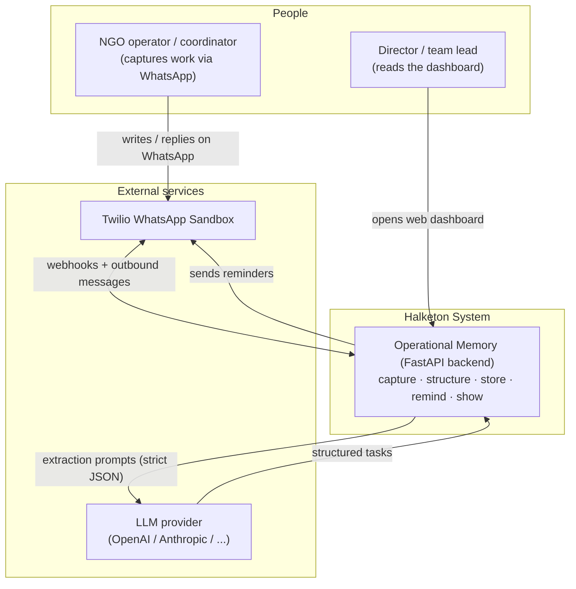
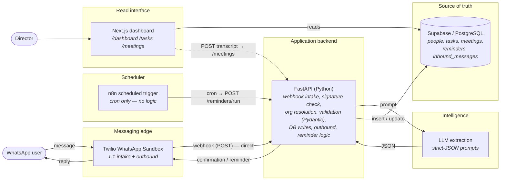
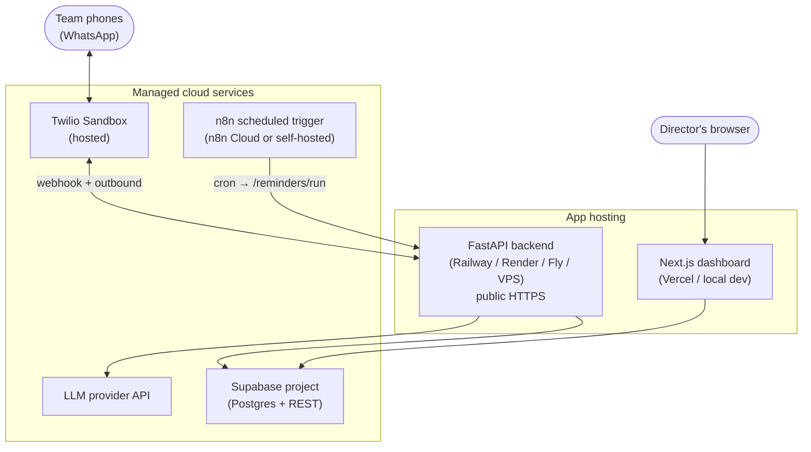
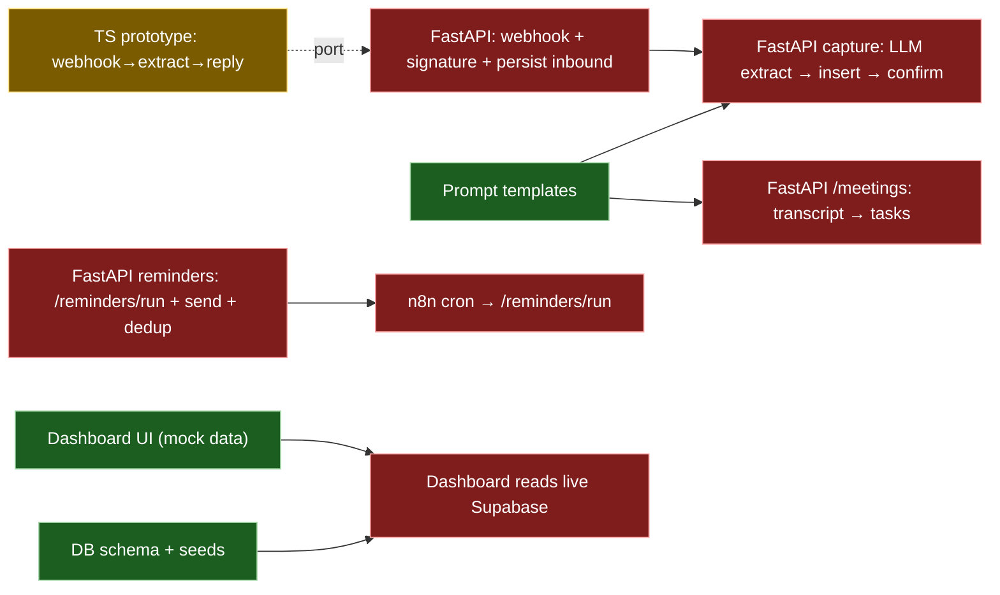

# Architecture Overview

> Halketon is a **WhatsApp-first operational memory layer** for NGO teams. It turns
> everyday WhatsApp messages and meeting transcripts into structured tasks that
> leadership can review on a simple dashboard.
>
> This document is the single source of truth for *how the system fits together*.
> For the product rationale see [`../product/mvp-definition.md`](../product/mvp-definition.md),
> for runtime sequences see [`../diagrams/flows.md`](../diagrams/flows.md), and for the
> database see [`data-model.md`](data-model.md).

---

## 1. The system in one sentence

A WhatsApp message → **Twilio** → a **FastAPI backend** that extracts structure with an
**LLM**, validates it, and stores it in **Supabase/Postgres** → visibility through a
**Next.js dashboard**, with reminders driven by an **n8n scheduled trigger** that calls
the backend (n8n's only remaining role).

---

## 2. System context (Level 1)

Who and what the system talks to.



---

## 3. Container view (Level 2)

The runtime building blocks and how data moves between them.



---

## 4. Components and responsibilities

| Component | Tech | Responsibility | Explicit non-responsibility |
|---|---|---|---|
| **Messaging edge** | Twilio WhatsApp Sandbox | Receive 1:1 WhatsApp messages, POST body + sender metadata **directly to the backend**, send confirmations & reminders | No WhatsApp **group** automation in the MVP |
| **Application backend** | FastAPI (Python) | Receive the webhook, validate the Twilio signature, resolve org + sender, call the LLM, validate strict JSON with Pydantic, insert/update Postgres, send outbound messages, run reminder logic. **Owns the business rules.** | Does **not** hold durable state (Postgres does); does **not** parse on the LLM's behalf |
| **Scheduler** | n8n scheduled trigger | Fire a cron and POST to the backend's `/reminders/run` endpoint | Holds **no** logic and is **not** in the inbound path |
| **Intelligence** | LLM + prompt templates | Extract tasks from messages and commitments from transcripts; return strict JSON with a confidence score and ambiguity flags | Does **not** persist anything or make product decisions |
| **Source of truth** | Supabase / PostgreSQL | Durable, normalized state for people, messages, tasks, meetings, reminders | Does **not** parse raw text |
| **Read interface** | Next.js dashboard | Show leadership open/overdue work, load per person, upcoming deadlines, unowned tasks; POST meeting transcripts to the backend | Does **not** parse raw WhatsApp; reads structured data only |

These boundaries are the project's guardrails — see [ADR 0001](../decisions/0001-mvp-stack.md) and
[ADR 0010](../decisions/0010-programmatic-fastapi-pipeline.md).

---

## 5. Technology stack

| Layer | Choice | Why |
|---|---|---|
| Channel | Twilio WhatsApp Sandbox | Fastest WhatsApp path; lives on the channel NGOs already use |
| Backend | FastAPI (Python) + Pydantic | Business rules in testable code; Pydantic gives strict-JSON validation; room for heavier LLM/data work |
| Scheduler | n8n scheduled trigger | A managed cron for the reminder loop without running our own scheduler (see [ADR 0010](../decisions/0010-programmatic-fastapi-pipeline.md)) |
| Extraction | LLM with strict-JSON prompts | Natural language in, structured data out, deterministic shape |
| Storage | Supabase / PostgreSQL | SQL source of truth, generous free tier, instant REST API |
| Dashboard | Next.js 16 (App Router) + React 18 | Simple read-optimized UI; starts on mock data |

---

## 6. Repository layout

```text
halketon/
├── README.md                     Project entry point + quick start
├── apps/
│   ├── api/                      FastAPI backend — the whole pipeline
│   │   ├── app/
│   │   │   ├── main.py           App factory + router wiring + /health
│   │   │   ├── routers/          whatsapp.py · reminders.py · meetings.py
│   │   │   ├── services/         llm.py · twilio_client.py · capture.py · follow_up.py
│   │   │   ├── models/           Pydantic schemas (strict-JSON contracts)
│   │   │   └── db/               Supabase/Postgres access
│   │   └── pyproject.toml
│   ├── dashboard-web/            Next.js leadership dashboard (reads mock data today)
│   │   ├── app/                  Routes: / /dashboard /tasks /meetings
│   │   └── lib/mock-data.ts      Demo data + dashboard summary logic
│   └── n8n-scheduler/            Reference export of the single reminder cron trigger
│       └── reminder-trigger.workflow.json
├── database/
│   ├── schema.sql                Postgres schema (enums, tables, triggers, indexes)
│   └── seeds.sql                 Demo data
├── prompts/
│   ├── task-extraction.md        Strict-JSON WhatsApp → task prompt
│   └── meeting-summary.md        Strict-JSON transcript → summary + tasks prompt
├── src/                          ⚠️ TS prototype — reference-only, removed after the FastAPI port
└── docs/
    ├── README.md                 Documentation index (start here)
    ├── product/                  MVP definition, hackathon brief, working notes
    ├── architecture/             This overview + data model
    ├── decisions/                Architecture Decision Records
    ├── diagrams/                 Runtime sequence flows
    └── reference/                Source PDF (base architecture & product definition)
```

---

## 7. Deployment view



In **local dev**, expose the FastAPI backend with a tunnel (ngrok / cloudflared) and paste
that URL into the Twilio Sandbox "when a message comes in" field. Secrets are supplied as
environment variables (see §9). No secrets are committed.

---

## 8. Implementation status (target vs. today)

The target architecture above is the destination. This is what is actually wired
**right now** — important for planning the hackathon build.



| Area | Status | Notes |
|---|---|---|
| Database schema + seeds | ✅ Complete | `database/schema.sql`, `database/seeds.sql` |
| Prompt templates | ✅ Complete | `prompts/*.md`, strict-JSON contracts |
| Dashboard UI | ✅ Complete (mock) | Reads `lib/mock-data.ts`; not yet wired to Supabase |
| TS prototype (`src/`) | 🟡 Reference | Working webhook→GPT-4o-mini→TwiML, **no DB**. Spec for the port; removed after FastAPI lands |
| FastAPI backend scaffold | 🔴 Not started | `apps/api/` — webhook, signature check, org resolution, persistence |
| Capture flow (FastAPI) | 🔴 Not started | LLM extract → validate (Pydantic) → insert `tasks` → confirm |
| Reminder loop (FastAPI + n8n cron) | 🔴 Not started | `/reminders/run` (auth'd) + send + dedup via `reminders`; n8n scheduled trigger |
| Live dashboard reads | 🔴 Not started | Swap `mock-data.ts` for Supabase queries |
| Meeting extraction flow | 🔴 Not started | `/meetings` endpoint; prompt + tables exist |

Legend: ✅ done · 🟡 partial / reference · 🔴 not started.

---

## 9. Configuration & environment

Provided as environment variables to the FastAPI backend (and Supabase to the dashboard once wired):

| Variable | Used by | Purpose |
|---|---|---|
| `SUPABASE_URL` | backend, dashboard | Supabase REST endpoint |
| `SUPABASE_SERVICE_ROLE_KEY` | backend | Server-side DB writes |
| `OPENAI_API_KEY` *(or chosen provider key)* | backend | LLM extraction calls |
| `TWILIO_ACCOUNT_SID` | backend | Twilio auth |
| `TWILIO_AUTH_TOKEN` | backend | Twilio auth + **webhook signature validation** |
| `TWILIO_WHATSAPP_FROM` | backend | Sandbox sender number |
| `REMINDER_TRIGGER_SECRET` | backend, n8n | Shared secret so only the n8n cron can call `/reminders/run` |

---

## 10. Security & privacy defaults

- Store original source messages (`inbound_messages`) for traceability, separate from
  normalized `tasks`.
- Treat message bodies as sensitive operational data.
- Avoid exposing sender phone numbers in aggregate dashboard views unless needed.
- Keep LLM prompts deterministic and schema-bound; **validate JSON with Pydantic before insertion**.
- The backend now owns hardening that n8n previously abstracted away:
  - **Twilio signature validation** on every inbound webhook (`X-Twilio-Signature` + `TWILIO_AUTH_TOKEN`).
  - **`/reminders/run` is authenticated** with `REMINDER_TRIGGER_SECRET` — never publicly callable.
  - **Idempotency / reminder de-duplication** in code (ADR 0008), via the `reminders` table.
