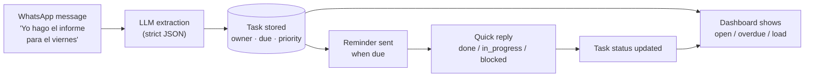
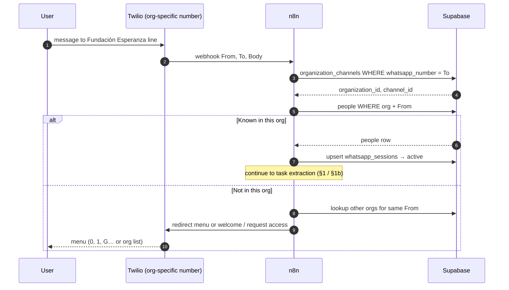
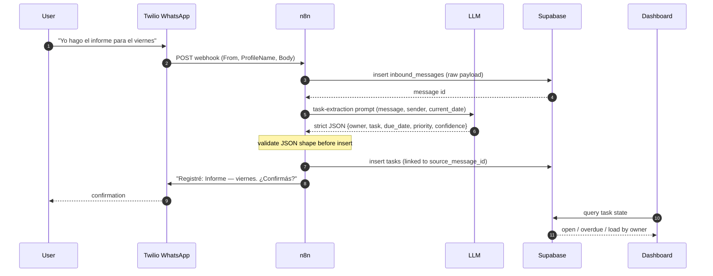
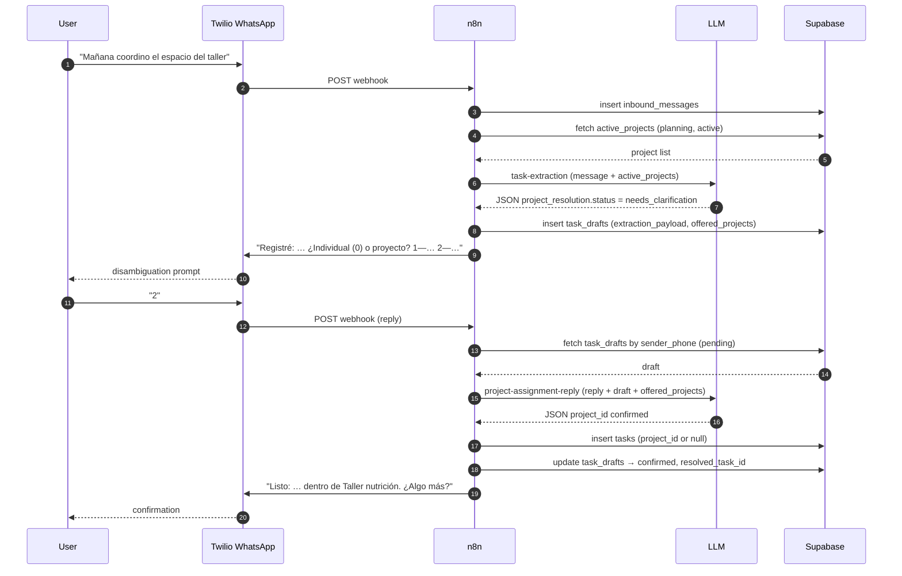
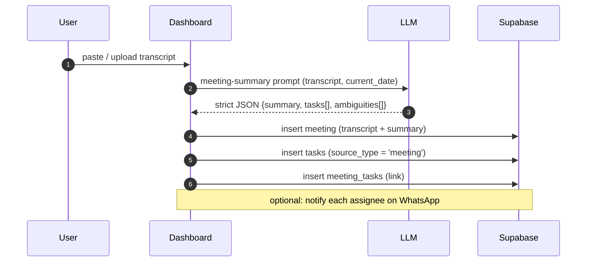
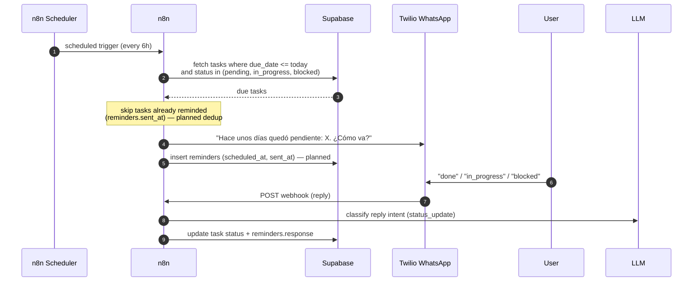

# Runtime Flows

Sequence diagrams for the system's runtime behavior. For the static structure see
[`../architecture/overview.md`](../architecture/overview.md); for tables see
[`../architecture/data-model.md`](../architecture/data-model.md).

> **Reading these:** solid arrows are calls/messages, dashed arrows are returns.
> Steps marked _(planned)_ are not yet wired — see the implementation status in the
> architecture overview, §8.

---

## End-to-end lifecycle

How a single commitment travels from a chat message to a closed task.

---

## 1a. WhatsApp org resolution (canal + identidad)

Before any task extraction, n8n resolves the org from the **Twilio `To` number** and
validates the **sender `From`** exists in `people` for that org. See
[`../../prompts/whatsapp-org-resolution.md`](../../prompts/whatsapp-org-resolution.md).

**Dual layer:** `To` → org · `From` + org → authorized person. Same phone in two orgs
uses two different Twilio numbers (no collision).

---

## 1. WhatsApp task creation

---

## 1b. WhatsApp task creation with project disambiguation

When the LLM cannot confidently match a project, it asks the user before inserting the task.
See [`../../prompts/task-extraction.md`](../../prompts/task-extraction.md) and
[`../../prompts/project-assignment-reply.md`](../../prompts/project-assignment-reply.md).

**Fast paths (no second turn):**

| `project_resolution.status` | Action |
|---|---|
| `matched` | Insert task with `project_id` immediately |
| `standalone` | Insert task individual (`is_global = false`, no project) |
| `is_global: true` | Insert global task (skip project flow) |
| `needs_clarification` | Draft + list: `0` individual, `G` global, numbered projects |

---

## 2. Meeting transcript extraction _(planned)_

---

## 3. Reminder + status update

### Quick-reply mapping

| Reply | Maps to |
|---|---|
| `done`, `hecho`, `listo`, `ok`, ✅ | `done` |
| `en proceso`, `sigo`, ⏳ | `in_progress` |
| `bloqueado`, `no puedo`, 🚫 | `blocked` |

Defined in [`../../prompts/task-extraction.md`](../../prompts/task-extraction.md).
