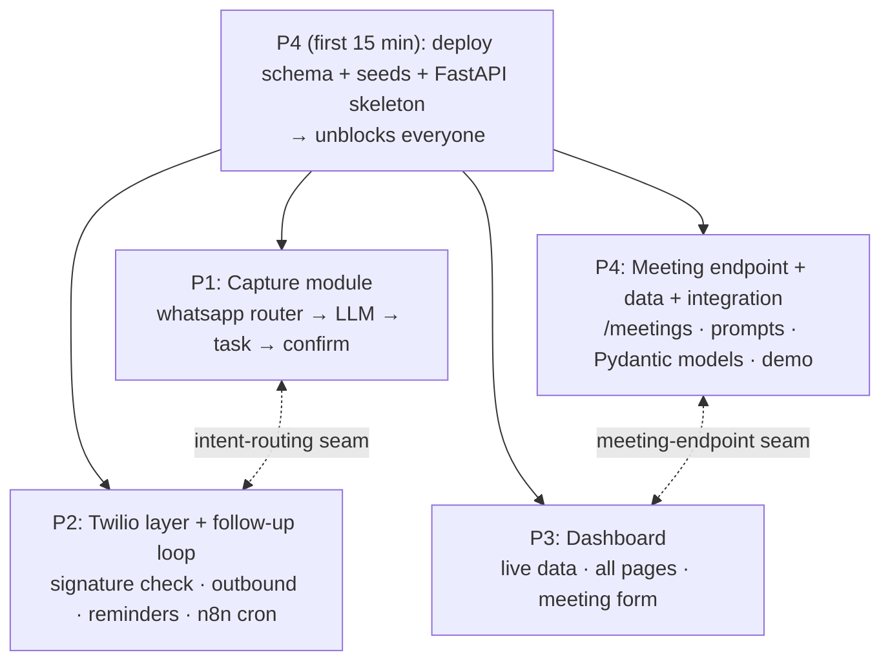

# Roles & Ownership

Four friends, in one room, building together for a day. Each person owns **one substantial,
comparably-sized chunk** so "who does what" is never fuzzy — but the silos are soft: we sit
together, so we pair on the tricky seams, swap when someone's stuck or bored, and everyone
swarms the critical path once their own piece lands. The plan is a backbone, not a cage.

See the system this maps onto in [`../architecture/overview.md`](../architecture/overview.md)
and the runtime flows in [`../diagrams/flows.md`](../diagrams/flows.md). The pipeline now lives
in a **FastAPI backend** (`apps/api/`), not in n8n — see
[ADR 0010](../decisions/0010-programmatic-fastapi-pipeline.md).

---

## How the work splits

The MVP is three flows over one shared foundation. We split so the load is even and each
person has a real deliverable. The flows are now **code modules in the FastAPI app**, not n8n
workflows:

There are exactly **two seams** where two people meet (marked above). Everything else is
independent. We agree both seam contracts at kickoff and then build either side of them
in parallel.

---

## The four roles

### P1 — Capture module  *(backend person)*
The single highest-value, highest-risk piece — so it's one person's whole focus, nothing
piled on top.

**Builds the inbound capture path in FastAPI** (`apps/api/app/routers/whatsapp.py` +
`services/capture.py`): receive a WhatsApp webhook → save `inbound_messages` → call the LLM
with `prompts/task-extraction.md` → validate the strict JSON with the Pydantic models →
branch on `intent`:
- `task_creation` → insert into `tasks` (linked to `source_message_id`) → send a WhatsApp confirmation.
- `status_update` → hand off to P2's follow-up logic (the intent-routing seam).

**Pairs with:** P2 — they share the inbound webhook router and the Twilio send. P2 hands P1
working "pipes" (a verified webhook + signature check, a send helper that delivers), P1 builds
the "brain" (extraction + insert). They sit next to each other and coordinate on
`routers/whatsapp.py`.

### P2 — Twilio messaging layer + follow-up loop  *(generalist)*
A real, owned domain: **everything about outbound/inbound WhatsApp messaging and the
follow-up loop.** This is infrastructure the other flows depend on *plus* a complete flow of
its own — substantial and clearly P2's.

**Builds:**
1. **Twilio messaging layer** (`services/twilio_client.py`) — join/configure the sandbox,
   **validate the `X-Twilio-Signature`** on inbound, and own the outbound send helper. P1's
   capture and P2's reminders both use this; P2 is the owner so it's built once, well.
2. **Reminder loop** (`routers/reminders.py` + `services/follow_up.py`) — the authenticated
   `POST /reminders/run` endpoint (called by the **n8n cron**, guarded by
   `REMINDER_TRIGGER_SECRET`): fetch due tasks → send reminder → record in `reminders`, and
   **dedup** (skip tasks already reminded via `reminders.sent_at`). **Also owns the single n8n
   scheduled-trigger config** that pings this endpoint.
3. **Status-reply branch** — when an inbound message is a `status_update`, map
   `done`/`in_progress`/`blocked` and update the task + the reminder's `response`. (This is the
   other half of the intent-routing seam with P1.)

### P3 — Dashboard  *(frontend/React person)*
Owns the entire read interface — a full person's worth of work, never blocked.

**Builds:**
- Swap `apps/dashboard-web/lib/mock-data.ts` for live Supabase reads on `/dashboard` and
  `/tasks` (keep the existing summary logic).
- Live `/meetings` list + the **meeting input form** that POSTs a transcript to P4's
  `/meetings` endpoint and renders the result (the meeting-endpoint seam).
- Demo polish — the dashboard is the face of the demo, so styling/empty-states/loading matter.

**Never blocked:** develops against `seeds.sql` from minute one. Owns *all* files under
`apps/dashboard-web/`. The dashboard is **read-only against the DB** (plus the one `/meetings`
POST) — it does not share code with the Python backend; the **DB schema is the contract**.

### P4 — Meeting endpoint + Data + Integration owner  *(SQL/data person)*
Front-loads the foundation, owns an independent flow, and — instead of a vague "float" —
takes the concrete **integration & demo owner** hat, which naturally ramps up at the end as
their build work stabilizes.

**Builds, in order:**
1. **First 15 min:** deploy `database/schema.sql` + `database/seeds.sql` to Supabase and lay
   down the **FastAPI skeleton** (`apps/api/app/main.py` + empty routers + `db/` access),
   announce "tables + app skeleton live." Unblocks P1, P2, P3.
2. **`/meetings` endpoint** (`apps/api/app/routers/meetings.py`) — receives `{transcript}` →
   runs `prompts/meeting-summary.md` → inserts `meetings` + `tasks` + `meeting_tasks` →
   returns `{summary, tasks[]}`.
3. **Prompts + Pydantic models** — owns `prompts/` and `apps/api/app/models/` (the strict-JSON
   schemas); extraction quality + output shape are shared dependencies everyone leans on.
4. **Integration & demo owner (back half of the day):** keeps `main` healthy, runs the
   end-to-end smoke check before each checkpoint, owns the demo environment + demo data + the
   deployed backend URL in Twilio, and tags the `demo-freeze`. This works because P4's
   foundation + meeting work front-loads, freeing them to integrate while others finish.

---

## Rough load balance

| Person | Primary deliverable | Weight |
|---|---|---|
| P1 | Capture module (inbound → task) | Heavy build, single focus |
| P2 | Twilio layer + reminders + status replies + n8n cron | Infra + one full flow |
| P3 | Whole dashboard + meeting form + polish | One full surface |
| P4 | Data + prompts + models + meeting endpoint + integration | Front-loaded build, then integration |

No one is a sidekick; no one is a pure floater. If reality drifts (P1's pipeline runs long,
P3 finishes early), we **rebalance out loud** — that's the advantage of sitting together.

---

## How we actually collaborate (we're in the same room)

- **Pair on the two seams.** P1+P2 on intent routing (the `whatsapp.py` branch); P3+P4 on the
  meeting endpoint. Agree the JSON shape, then split.
- **Swarm the critical path.** The moment your own piece is merged and smoke-passing, go help
  whatever's blocking the demo (usually the capture flow). Finishing your slice early ≠ done.
- **Talk before touching shared things.** Schema, prompt, or Pydantic-model change? Say it out
  loud first — it's a contract others build on.
- **Swap if stuck or bored.** Two heads on a gnarly endpoint beats one person grinding for an
  hour. Trade tasks if it keeps the day fun — the role table is who's *accountable*, not who's
  *forbidden*.
- **Quick verbal syncs**, not formal standups: a 2-minute "where's everyone at?" at each
  checkpoint (see [`timeline-and-checkpoints.md`](timeline-and-checkpoints.md)).

---

## File-ownership map (conflict avoidance)

Slices map onto **different files/directories**, so merge conflicts are naturally rare. Stay in
your lane; coordinate on the two seams.

| Path | Owner |
|---|---|
| `apps/api/app/routers/whatsapp.py` | P1 (shared edits with P2 on the intent branch) |
| `apps/api/app/services/capture.py` | P1 |
| `apps/api/app/routers/reminders.py` · `services/follow_up.py` · `services/twilio_client.py` | P2 |
| `apps/api/n8n-scheduler/` *(reminder cron config)* | P2 |
| `apps/api/app/routers/meetings.py` | P4 |
| `apps/api/app/models/**` *(Pydantic schemas)* | P4 |
| `apps/api/app/main.py` · `db/**` | P4 (skeleton), then shared — coordinate |
| `apps/dashboard-web/**` | P3 |
| `database/**` | P4 |
| `prompts/**` | P4 |
| `docs/**` | anyone (small PRs) |

> The previously-planned shared `packages/core` (TS pure logic for n8n + dashboard) is **dropped**:
> with a Python backend and a TS dashboard there is no shared code module. Shared *pure logic*
> (normalizers, validators, mappers) lives in `apps/api/app/` and is unit-tested there; the
> dashboard only reads the DB.

---

## Shared contracts (freeze early, change rarely)

These are the interfaces between people. Lock them in the first hour; changes are announced
out loud and go through the owner.

1. **DB schema** (`database/schema.sql`) — now the **primary cross-language contract** between
   the Python backend (writer) and the TS dashboard (reader). Owner: P4. Develop everything
   against `seeds.sql`.
2. **LLM output JSON / Pydantic models** (`prompts/*.md` + `apps/api/app/models/`) — the
   contract between the LLM and the backend's insert logic. Owner: P4.
3. **Intent-routing seam** (P1 ↔ P2) — the inbound webhook detects `intent`; `task_creation`
   stays with P1, `status_update` calls P2's follow-up logic. Agree how the branch hands off
   inside `routers/whatsapp.py` (a call into P2's `services/follow_up.py`).
4. **Meeting-endpoint seam** (P3 ↔ P4) — request `POST /meetings { transcript }`, response
   `{ summary, tasks[] }`. Owner: P4, consumer: P3. Meeting extraction lives in the backend
   (not the Next.js app) so LLM keys stay server-side and ownership stays clean.
